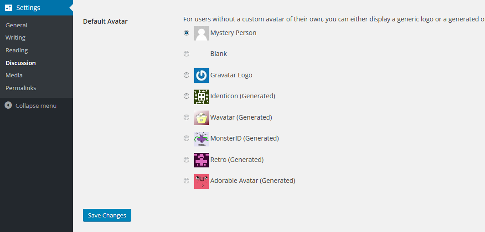

# Adorable Avatars

This plugin integrates the [Adorable Avatars](http://avatars.adorable.io/) avatar placeholder service into WordPress.

## Installation

1. [Download ZIP](https://github.com/tfrommen/adorable-avatars/archive/master.zip).
1. Upload contents to the `/wp-content/plugins` directory on your web server.
1. Activate the plugin through the _Plugins_ menu in WordPress.
1. Select _Adorable Avatars_ as default avatar setting on the _Discussion Settings_ page in your WordPress backend.

## Screenshots

  
**Default Avatar setting** - Here you can select _Adorable Avatars_ as default avatar setting.

## Contribution

If you have a feature request, or if you have developed the feature already, please feel free to use the Issues and/or Pull Requests section.

Of course, you can also provide me with translations if you would like to use the plugin in another not yet included language.

## Changelog

[Changelog](CHANGELOG.md)
